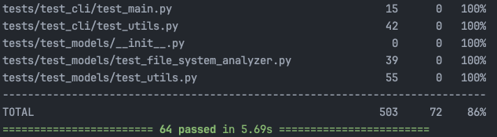

# File System Analyzer

 

# How to run the tool

I have developed this project as a library using `uv` as a project and a package manager. However I have also maintained
a `requirements.txt` file, so you can run this project without using `uv`.

+ Clone the repo: `git clone https://github.com/georgelepsaya/file-system-analyzer.git`.
+ `cd file-system-analyzer`

## Simply using `requirements.txt` (good for demo)

+ Create a virtual environment: `python3 -m venv .venv`
+ Activate the virtual environment: `. .venv/bin/activate`
+ Install the project in editable mode: `pip install -e .`
+ Run the tool: `fsa -h`

## Using `uv` (good for contributing)

+ Install `uv` if it isn't installed already, e.g. `curl -LsSf https://astral.sh/uv/install.sh | sh`
+ Install dependencies:
   - All dependencies: `uv sync`
   - Excluding dev dependencies: `uv sync --no-dev`. This will skip `pytest` and `pytest-cov` installation
+ Run the tool
   - If virtual environment isn't activated: `uv run fsa -h`
   - If it's activated: `fsa -h`

# Dependencies of the project

A couple of packages outside the Python's standard library were carefully chosen.

## File signatures

To properly detect file signatures without reinventing the wheel, `python-magic` package, which is a wrapper around
`libmagic` was used, which allowed to detect raw descriptions of files and also their more structured MIME types.

## CLI output

After attempting to do structuring and coloring of the output myself and avoid using external libraries, I gave in to
the `rich` package which offered great functionality to create nice tables, panels and beautifully formatted text.

## Testing

I used `pytest` for creating unit tests for the tool, along with `pytest-cov` to get coverage of my unit tests. Currently
the coverage stands at **86%**. See a part of the log below. You can see the test cases I used in the `tests/` directory
of this project.

# Functionality

## Categorization

The tool categorizes files into the following categories:
   - Text
   - Document
   - Image
   - Audio
   - Video
   - Presentation
   - Spreadsheet
   - Archive
   - Executable
   - Other

It performs the categorization this way:

+ First it tries to use `libmagic` to get a MIME format file type based on file signatures. If the top-level category is text, audio, video or
image, then it simply puts the file in that category. If however the type is `application`, then...
+ The tool uses a mapping from some application MIME types to file categories. If mapping is unsuccessful...
+ Tool tried to match the raw `libmagic` description to a predefined regex pattern compiled from possible terms. If
a match is found, a category is returned. Otherwise...
+ Tool falls back to categorization based on file extension using a defined mapping.

In case `libmagic` is not present on the user's machine, they can still run the tool, `python-magic` will not be used
and categorization will be performed only based on file extensions.

## CLI

Users can provide threshold size in B, KiB, MiB, GiB, TiB or PiB (no unit is specified size assumed to be in B). 
Sizes will be converted to bytes, since bytes are the primary unit in the tool. Analyzer does necessary conversions
of output size values when printing them back to users.

## Permissions

To detect unusual permissions, the tool identifies the following masks:
- World-writable
- Group-writable
- World-executable
- Group-executable
- Setuid
- Setgid
- Sticky bit

# Continuous integration

I used GitHub actions for an automated testing pipeline. It is set up to test on the latest Ubuntu version and the
latest macOS version. And for each OS, it tests for three python versions: 3.11, 3.12 and 3.13. Tests are run on every 
push and every PR.

